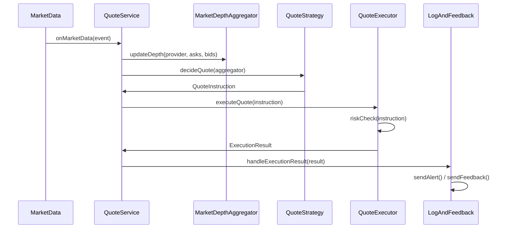
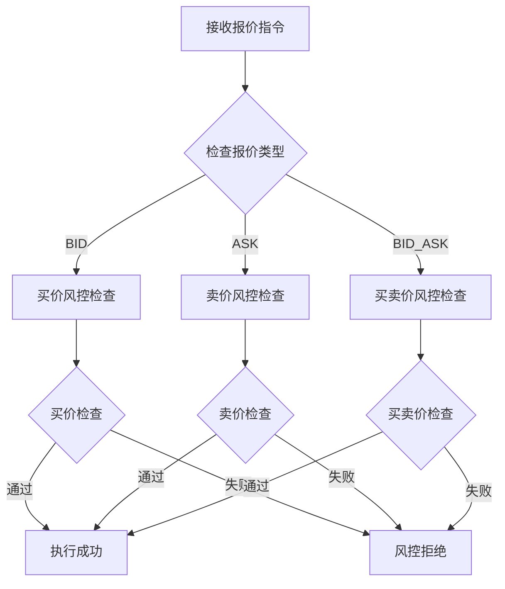

# 技术架构文档

## 架构概述

本系统采用DDD（领域驱动设计）架构模式，结合Spring Boot框架构建。系统专注于行情数据接收和自动报价的核心业务领域，通过清晰的领域边界和职责分离实现高内聚、低耦合的设计。

## DDD架构设计

### 1. 分层架构

```
┌─────────────────────────────────────┐
│           应用层 (Application)       │
│  - 演示程序 (Demo)                  │
│  - 配置管理                         │
└─────────────────────────────────────┘
┌─────────────────────────────────────┐
│           领域层 (Domain)           │
│  - 实体 (Entities)                  │
│  - 领域服务 (Domain Services)       │
│  - 值对象 (Value Objects)           │
└─────────────────────────────────────┘
┌─────────────────────────────────────┐
│        基础设施层 (Infrastructure)   │
│  - Spring Boot框架                 │
│  - 数据库连接                       │
│  - 外部服务集成                     │
└─────────────────────────────────────┘
```

### 2. 领域模型

#### 核心实体

**MarketDataEvent (行情数据事件)**
- **职责**: 表示从外部数据源接收的行情数据
- **属性**: 交易对、数据提供商、买卖盘深度
- **行为**: 数据验证、格式化

**QuoteInstruction (报价指令)**
- **职责**: 表示系统生成的报价指令
- **属性**: 交易对、报价类型、价格、数量、策略名称
- **行为**: 支持三种报价模式（买价、卖价、买卖价）

**MarketDepthAggregator (市场深度聚合器)**
- **职责**: 聚合多个数据源的深度数据
- **属性**: 交易对、各提供商的深度数据
- **行为**: 数据聚合、最优价格计算

**OrderBookLevel (订单簿层级)**
- **职责**: 表示订单簿中的价格和数量层级
- **属性**: 价格、数量
- **行为**: 价格比较、数量计算

**ExecutionResult (执行结果)**
- **职责**: 表示报价指令的执行结果
- **属性**: 执行状态、消息、指令、执行时间
- **行为**: 结果格式化、状态查询

#### 领域服务

**QuoteStrategy (报价策略接口)**
- **职责**: 定义报价策略的抽象契约
- **方法**: `decideQuote(MarketDepthAggregator aggregator)`
- **设计模式**: 策略模式

**QuoteService (核心报价服务)**
- **职责**: 协调整个报价业务流程
- **流程**: 数据接收 → 聚合 → 策略决策 → 风控检查 → 执行 → 反馈
- **设计模式**: 外观模式

**QuoteExecutor (报价执行器)**
- **职责**: 执行报价指令并进行风控检查
- **功能**: 风控验证、指令执行、结果返回
- **设计模式**: 命令模式

**LogAndFeedBack (日志反馈服务)**
- **职责**: 处理执行结果并发送反馈
- **功能**: 日志记录、告警发送、市场反馈
- **设计模式**: 观察者模式

## 设计模式应用

### 1. 策略模式 (Strategy Pattern)

```java
public interface QuoteStrategy {
    QuoteInstruction decideQuote(MarketDepthAggregator aggregator);
}

public class SimpleBestPriceStrategy implements QuoteStrategy {
    // 实现简单最优价格策略
}

public class MyCustomStrategy implements QuoteStrategy {
    // 实现自定义策略
}
```

**优势**:
- 支持多种报价策略
- 易于扩展新策略
- 策略之间解耦

### 2. 工厂模式 (Factory Pattern)

```java
public class QuoteInstruction {
    // 静态工厂方法
    public static QuoteInstruction createBidQuote(...)
    public static QuoteInstruction createAskQuote(...)
    public static QuoteInstruction createBidAskQuote(...)
}
```

**优势**:
- 简化对象创建
- 提供语义化的创建方法
- 支持不同报价模式

### 3. 聚合模式 (Aggregate Pattern)

```java
public class MarketDepthAggregator {
    // 作为聚合根，管理特定交易对的所有深度数据
    private final Map<String, NavigableMap<BigDecimal, BigDecimal>> askDepth;
    private final Map<String, NavigableMap<BigDecimal, BigDecimal>> bidDepth;
}
```

**优势**:
- 确保数据一致性
- 简化数据访问
- 维护业务规则

### 4. 观察者模式 (Observer Pattern)

```java
public class QuoteService {
    public void onMarketData(MarketDataEvent event) {
        // 处理行情数据
        // 通知相关组件
        logAndFeedback.handleExecutionResult(result);
    }
}
```

**优势**:
- 松耦合的事件处理
- 支持多个观察者
- 易于扩展新的事件处理器

## 业务流程设计

### 1. 行情数据处理流程



### 2. 风控检查流程



## 数据流设计

### 1. 行情数据流

```
外部数据源 → MarketDataEvent → MarketDepthAggregator → 最优价格计算
```

### 2. 报价指令流

```
策略决策 → QuoteInstruction → 风控检查 → 执行 → 结果反馈
```

### 3. 状态管理

- **行情数据状态**: 通过 `MarketDepthAggregator` 维护
- **报价指令状态**: 通过 `ExecutionResult` 跟踪
- **系统状态**: 通过日志和监控管理

## 并发设计

### 1. 线程安全

```java
// 使用线程安全的数据结构
private final Map<String, MarketDepthAggregator> aggregators = new ConcurrentHashMap<>();
```

### 2. 原子操作

- 行情数据更新: 原子性更新深度数据
- 报价指令执行: 原子性检查和执行
- 状态变更: 原子性状态转换

### 3. 锁策略

- **读多写少**: 使用 `CopyOnWriteArrayList` 优化读取性能
- **写多读少**: 使用 `ConcurrentHashMap` 优化写入性能
- **读写平衡**: 使用 `TreeMap` 保证有序性

## 扩展性设计

### 1. 策略扩展

```java
// 新增策略只需实现接口
public class AdvancedStrategy implements QuoteStrategy {
    @Override
    public QuoteInstruction decideQuote(MarketDepthAggregator aggregator) {
        // 实现高级策略逻辑
    }
}
```

### 2. 风控扩展

```java
// 新增风控规则
private boolean checkAdvancedRisk(QuoteInstruction instruction) {
    // 实现高级风控逻辑
}
```

### 3. 数据源扩展

```java
// 支持新的数据提供商
public class NewProviderAdapter {
    public MarketDataEvent adapt(ProviderData data) {
        // 适配新数据源
    }
}
```

## 性能优化

### 1. 内存优化

- **对象池**: 重用频繁创建的对象
- **缓存策略**: 缓存计算结果
- **延迟加载**: 按需加载数据

### 2. CPU优化

- **算法优化**: 使用高效的数据结构
- **并行处理**: 多线程处理独立任务
- **批量处理**: 批量处理行情数据

### 3. I/O优化

- **异步处理**: 异步处理非关键路径
- **连接池**: 复用数据库连接
- **缓存**: 减少重复计算

## 监控和可观测性

### 1. 日志设计

```java
// 结构化日志
System.out.println(String.format("[Strategy] 生成%s指令: %s", 
    instruction.getQuoteType(), instruction));
```

### 2. 指标监控

- **业务指标**: 报价成功率、风控拒绝率
- **性能指标**: 响应时间、吞吐量
- **系统指标**: CPU、内存、网络

### 3. 告警机制

```java
// 风控告警
private void sendAlert(ExecutionResult result) {
    System.err.println(String.format("[日志&反馈] ⚠️ 告警: %s", result.getMessage()));
}
```

## 安全设计

### 1. 数据验证

- **输入验证**: 验证行情数据的有效性
- **业务验证**: 验证报价指令的合理性
- **边界检查**: 检查价格范围和数据边界

### 2. 风控安全

- **价格检查**: 防止异常价格
- **数量检查**: 防止异常数量
- **频率控制**: 防止高频异常操作

### 3. 审计日志

- **操作日志**: 记录所有关键操作
- **变更日志**: 记录配置变更
- **错误日志**: 记录异常情况

## 部署架构

### 1. 单机部署

```
┌─────────────────────────────────────┐
│           应用服务器                │
│  ┌─────────────────────────────┐   │
│  │      Spring Boot 应用       │   │
│  │  - 行情数据处理             │   │
│  │  - 报价策略执行             │   │
│  │  - 风控检查                 │   │
│  └─────────────────────────────┘   │
└─────────────────────────────────────┘
```

### 2. 集群部署

```
┌─────────────────────────────────────┐
│           负载均衡器                │
└─────────────────────────────────────┘
           │
    ┌──────┼──────┐
    │      │      │
┌───▼───┐ ┌▼───┐ ┌▼───┐
│ 节点1 │ │节点2│ │节点3│
└───────┘ └─────┘ └─────┘
```

## 故障恢复

### 1. 容错机制

- **重试机制**: 失败操作自动重试
- **降级策略**: 关键功能降级处理
- **熔断机制**: 防止级联故障

### 2. 数据恢复

- **备份策略**: 定期备份关键数据
- **恢复流程**: 明确的数据恢复流程
- **一致性检查**: 数据一致性验证

### 3. 监控告警

- **健康检查**: 定期检查系统健康状态
- **异常告警**: 及时告警异常情况
- **自动恢复**: 自动恢复可恢复的故障

## 总结

本系统采用DDD架构设计，通过清晰的领域边界和职责分离，实现了高内聚、低耦合的系统架构。系统支持三种报价模式，具备完善的风控机制，具有良好的扩展性和可维护性。

关键设计原则：
1. **单一职责**: 每个类只负责一个明确的职责
2. **开闭原则**: 对扩展开放，对修改关闭
3. **依赖倒置**: 依赖抽象而非具体实现
4. **接口隔离**: 使用专门的接口而非通用接口
5. **里氏替换**: 子类可以替换父类而不影响程序正确性
