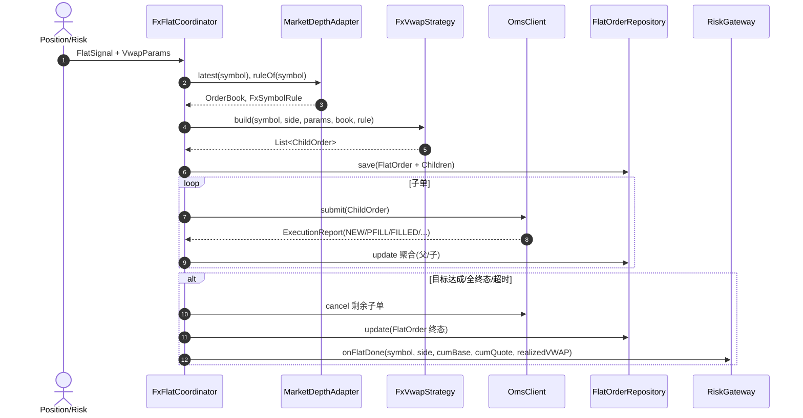

## FX 平盘模块说明

本模块在不侵入现有报价代码的前提下，新增“外汇平盘（VWAP 拆单 + OMS 执行 + 成交聚合）”能力。核心目标：将来自持仓/风控的平盘信号，转化为一组按盘口逐档拆分的子订单，提交至 OMS，并在回报中聚合计算成交统计与实际 VWAP，最终回调授信/风险模块。

### 术语与单位
- **符号单位**: 价格单位=Quote/Base；数量单位=Base。
- **方向 Side**: BUY=买 Base/付 Quote；SELL=卖 Base/收 Quote。
- **目标类型 TargetType**:
  - BASE_QTY: 目标为 Base 数量；
  - QUOTE_NOTIONAL: 目标为 Quote 金额（预算）。
- **执行意图 ExecutionIntent**: MAKER（被动）、TAKER（主动）、AUTO（由策略决定）。

## 代码结构
- `src/main/java/com/example/trade/demo/domain/fx/`
  - `FxTypes.java`: 基础枚举与 `FxSymbol`、`FxSymbolRule`。
  - `OrderBookModels.java`: 聚合订单簿模型 `ProviderDepth/PriceLevel/OrderBook`。
  - `FlatModels.java`: 平盘相关模型 `FlatSignal/VwapParams/ChildOrder/FlatOrder`。
  - `VwapStrategy.java`: 策略接口与实现 `FxVwapStrategy`（BUY/SELL × BASE/QUOTE 四种组合）。
  - `OmsAndRepo.java`: `OmsClient/ExecutionReport/FlatOrderRepository/RiskGateway` 及内存实现。
  - `FxFlatCoordinator.java`: 从平盘信号到完成的执行编排（提交/回报/聚合/超时/收尾）。
  - `Adapters.java`: 适配现有 `domain.entity.MarketDepthAggregator` 为 FX `OrderBook`。
- 示例：`src/main/java/com/example/trade/demo/QuoteFlatDemo.java`

## 核心流程


## 快速上手
1) 构建与测试：
```bash
./mvnw -B -V test
```
2) 运行端到端示例：
```bash
java -cp target/classes com.example.trade.demo.QuoteFlatDemo
```
输出将包含：子单提交与回报日志、父单累计 `cumBase/cumQuote` 与实际 `VWAP`。

## 适配与扩展
- **行情聚合**：
  - 现有 `domain.entity.MarketDepthAggregator` 通过 `Adapters.MarketDepthAdapter` 适配为 FX `OrderBook`。
  - 若对接其它来源，只需实现 `FxFlatCoordinator.MarketDepthAggregatorFx` 即可。
- **VWAP 拆单策略**：
  - 缺省实现 `FxVwapStrategy`，支持：
    - BUY + BASE_QTY → 扫 ASK（价格升序）；
    - SELL + BASE_QTY → 扫 BID（价格降序）；
    - BUY + QUOTE_NOTIONAL → MAKER 走 BID 金额预算/Taker 扫 ASK；
    - SELL + QUOTE_NOTIONAL → MAKER 走 ASK 金额预算/Taker 扫 BID。
  - 支持 tick 对齐与数量精度裁剪，防止越价与精度错误。
- **OMS 与回报**：
  - 接口 `OmsClient`：`submit/cancel/replace` + 回报 `ExecutionReport`。
  - 示例 `InMemoryOms` 会立即回报 NEW/部分成交/成交。
  - 对接真实 OMS 时，按 venue 回报映射 `OrdStatus/lastQtyBase/lastPx` 即可。
- **持久化**：
  - `FlatOrderRepository` 提供父/子单保存与更新接口；示例为内存实现 `InMemoryFlatRepo`。
  - 生产场景可替换为数据库/缓存（需考虑幂等键 `clientOrderId`）。
- **风控/授信回调**：
  - `RiskGateway#onFlatDone` 接收聚合结果（符号、方向、累计 Base/Quote、实际 VWAP）。

## API 速览
关键接口与模型（精简版，仅示意）：
```java
// 基础
// 符号：Base/Quote；示例 EUR/USD
record FxSymbol(String base, String quote) {}
// 符号规则：tickSize=最小价位，priceScale=价格小数位，baseQtyScale=Base数量精度，quoteNotionalScale=Quote金额精度
record FxSymbolRule(BigDecimal tickSize, int priceScale, int baseQtyScale, int quoteNotionalScale) {}
// 方向：对 Base 的买/卖
enum Side { BUY, SELL }
// 目标类型：按 Base 数量或 Quote 金额驱动
enum TargetType { BASE_QTY, QUOTE_NOTIONAL }
// 执行意图：被动(MAKER)/主动(TAKER)/自动(AUTO)
enum ExecutionIntent { MAKER, TAKER, AUTO }

// 订单簿与参数
// 单个流动性提供者在该价位可用的 Base 数量
record ProviderDepth(String providerId, BigDecimal baseQty) {}
// 价位聚合：price 单位=Quote/Base；providers 列表给出各 LP 可成交的 Base 数量
record PriceLevel(BigDecimal price, List<ProviderDepth> providers) {}
// 聚合订单簿：asksAsc 从低到高；bidsDesc 从高到低
record OrderBook(List<PriceLevel> asksAsc, List<PriceLevel> bidsDesc) {}
// VWAP 参数：targetValue 按 targetType 解释；ttl/intent/slippageBuffer 作为可选保护
record VwapParams(FxSymbol symbol, TargetType targetType, BigDecimal targetValue,
                  ExecutionIntent intent, Duration ttl, BigDecimal slippageBuffer) {}
// 平盘触发信号：suggestedTarget 为上游建议值，可等于或不同于 targetValue
record FlatSignal(FxSymbol symbol, Side side, BigDecimal suggestedTarget, String reason, Instant ts) {}

// 订单与状态
// 子单：qtyBase 单位为 Base，price 单位为 Quote/Base
enum OrdStatus { PENDING_NEW, NEW, PARTIALLY_FILLED, FILLED, REJECTED, CANCELED, EXPIRED, REPLACED }
final class ChildOrder { String clientOrderId; FxSymbol symbol; Side side; BigDecimal price; BigDecimal qtyBase; /* cumBase/status 等 */ }
// 母单：按 targetType 聚合达成度；cumBase/cumQuote 用于计算实际 VWAP
final class FlatOrder { String flatOrderId; FxSymbol symbol; Side side; TargetType targetType; BigDecimal targetBase; BigDecimal targetQuote; List<ChildOrder> children; /* cumBase/cumQuote/status 等 */ }

// 策略与编排
// VWAP 拆单：根据 Side × TargetType 决定扫盘侧或预算侧
interface VwapStrategy {
  List<ChildOrder> build(FxSymbol symbol, Side side, VwapParams params, OrderBook book, FxSymbolRule rule, String flatOrderId);
}
// OMS 客户端：回报流需包含状态与增量成交 (lastQtyBase × lastPx)
interface OmsClient {
  void submit(ChildOrder child, java.util.function.Consumer<ExecutionReport> onReport);
  void cancel(ChildOrder child, java.util.function.Consumer<ExecutionReport> onReport);
  void replace(ChildOrder child, BigDecimal newPx, java.util.function.Consumer<ExecutionReport> onReport);
}
// 回报：ordStatus 为订单状态；lastQtyBase 表示本次新增成交的 Base 数量
record ExecutionReport(String clientOrderId, String venueOrderId, OrdStatus ordStatus,
                       BigDecimal lastQtyBase, BigDecimal lastPx, Instant ts, String reason) {}
```

## 注意事项
- 精度：价格按 `priceScale`，Base 数量按 `baseQtyScale`，Quote 金额按 `quoteNotionalScale`。
- 对齐：Bid 侧向下取整（FLOOR），Ask 侧向上取整（CEILING）后再按 HALF_UP 设定精度。
- 终止条件：目标达成（Base/Quote）、所有子单终态、父单超时；均会触发取消残单与风控回调。
- 幂等：`clientOrderId` 作为子单幂等键；父单用 `flatOrderId` 聚合。

## 迁移与集成建议
- 从报价系统迁移时无需修改现有 `QuoteService/Strategy/Executor`；平盘模块独立运行。
- 若需要统一事件总线，可在 `FxFlatCoordinator` 内置异步发布成交事件，替代当前回调。
- 对接市价 Taker 模式时，建议额外引入滑点保护 `slippageBuffer` 与价格带保护。


